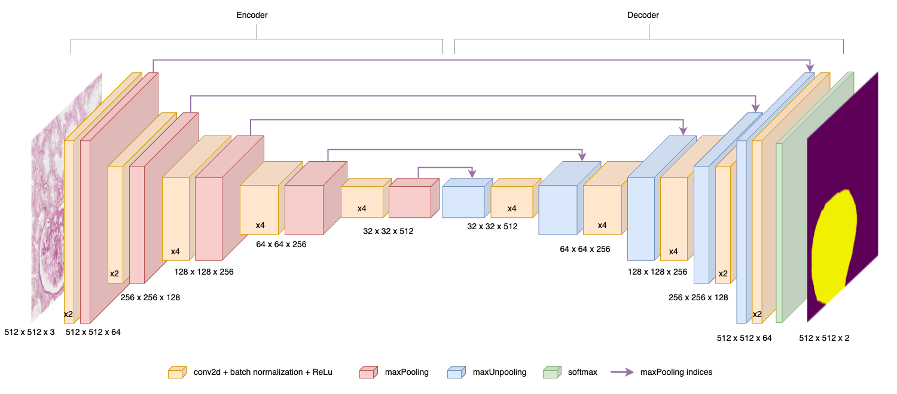
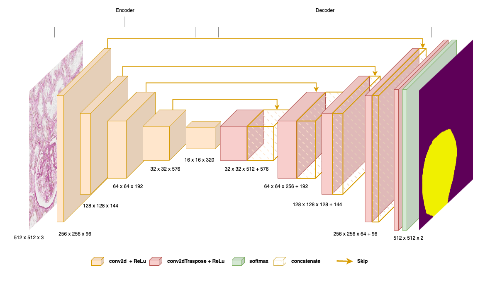
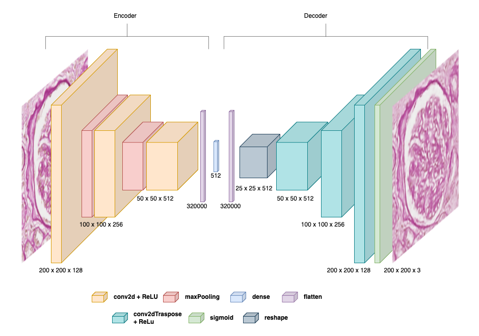
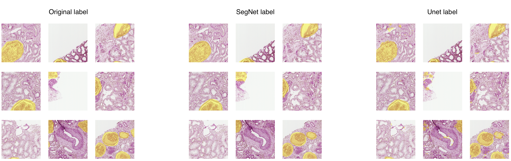
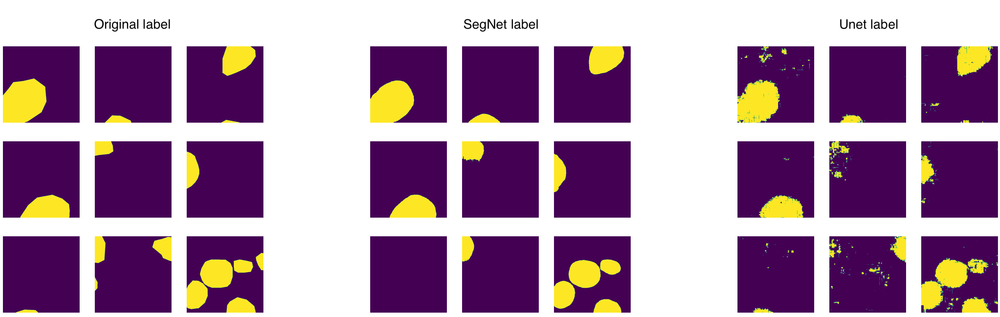

# GlomeruLearn: Advanced Deep Learning for Kidney Tissue Analysis

## Overview

This project focuses on the application of Machine Learning (ML) techniques for the detection and classification of glomeruli in renal biopsy slide images. Glomeruli play a crucial role in kidney function by filtering blood to form urine. The project aims to automate the identification of glomeruli using supervised learning models and classify them based on the degree of necrosis in an unsupervised manner. This approach is essential for supporting nephropathological studies, particularly in the contexts of Diabetes Mellitus Type 1 (DM1) and Type 2 (DM2).

## Objectives

The primary objectives of this project are as follows:
- **Glomeruli Detection:** Implement and compare the performance of two semantic segmentation architectures, SegNet and U-Net, for the accurate detection of glomeruli in Whole Slide Images (WSIs) of kidney sections.
- **Glomeruli Classification:** Without ground truth for glomeruli classification, employ unsupervised learning techniques to classify glomeruli based on the level of necrosis. This involves feature extraction through Principal Component Analysis (PCA) or the latent space of an autoencoder, followed by clustering.

## Methodology

1. **Data Preprocessing:** The dataset consists of WSIs of human kidney sections, annotated to highlight glomeruli. These large images are partitioned into manageable patches, preprocessed to enhance model performance, and augmented to address class imbalance.
   
2. **Semantic Segmentation:** Two state-of-the-art models, SegNet and U-Net, are utilized to perform pixel-wise classification of glomeruli. The models are evaluated based on accuracy, loss, and Mean Intersection over Union (MeanIoU) metrics to determine the best approach for glomeruli detection.

*SegNet Architecture*

*U-Net Architecture*

3. **Feature Extraction and Clustering:**
   - Feature extraction is carried out using autoencoders, VGG19, and ResNet50 models to reduce the dimensionality of the image data and capture essential features for clustering.
   - The extracted features are then subjected to clustering using the K-means algorithm to classify the glomeruli based on their necrosis levels. Dimensionality reduction techniques like Isomap and t-SNE are applied to improve clustering performance.

*Autoencoder Architecture*

## Results

The project successfully implements semantic segmentation models for the detection of glomeruli with promising accuracy. However, the unsupervised classification of glomeruli based on necrosis levels using K-means clustering did not yield satisfactory results, highlighting the challenges in applying unsupervised methods to complex histological images without explicit labels.

*Comparison of results between ground truth, SegNet and U-Net segmentation*

*Images from K-means (silhouette score) applied to autoencoder features reduced throw isomap*

*Images from K-means (DB score) applied to ResNet50 features*

*Images from K-means (CH score) applied to VGG-19 features*

## Conclusions and Future Work

The study demonstrates the potential of ML models in automating the detection of glomeruli from renal biopsy images.

A promising direction for future work involves exploring contrastive learning to refine the feature representation and classification of glomeruli. Contrastive learning, by emphasizing the learning of distinct features that differentiate between classes, could potentially offer a more nuanced and effective approach to mapping glomeruli variations. This method's inherent capability to enhance the distinction between various states of glomeruli could lead to superior classification accuracy, especially in distinguishing subtle differences in sclerosis levels. By leveraging contrastive learning, the project aims to achieve more refined and clinically relevant outcomes, significantly advancing the automated analysis of renal biopsy images.